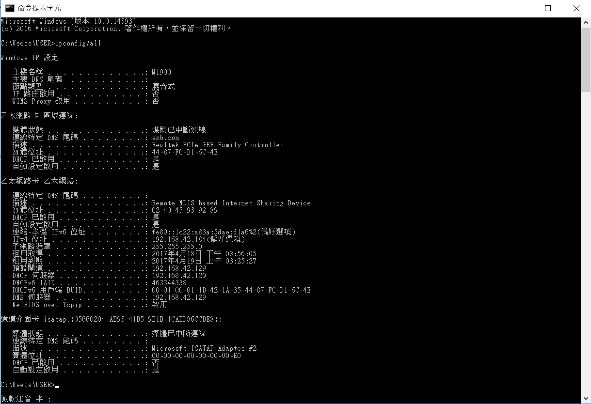

Title: 20170222 Week 1
Date: 2017-02-22 12:00
Category: Course
Tags: teach
Slug: Week 1
Author: 40423213

修改stunnel.conf的IP設定

開啟命令提示字元，輸入"ipconfig/all"

<!-- PELICAN_END_SUMMARY -->

找到IPv4位址，將IP複製至SciTE存放

至tiny2017_1GB/data/stunnel/config將stunnel.conf檔案拖曳至SciTE開啟

拉至下方，將檔案內的IP修改成正確IP

儲存並關閉，之後再重啟start就成功了

心得: 運用ipconfig/all指令來搜尋自身IP，既方便又省時
