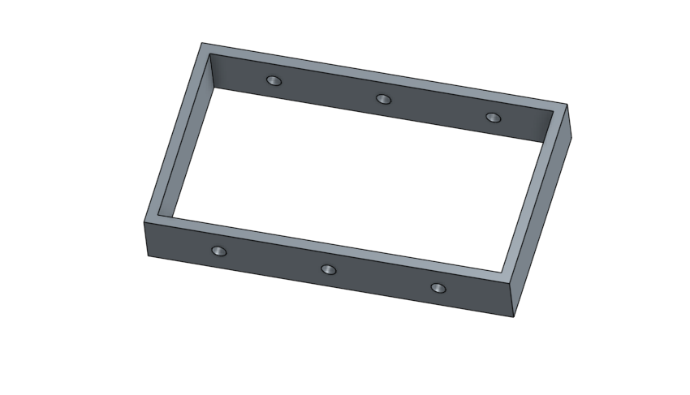
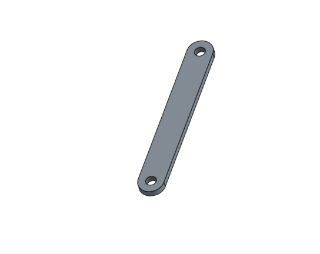
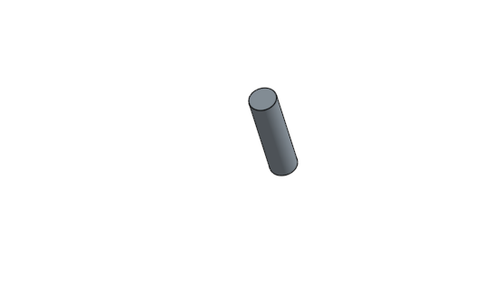

Title: 期中作業2
Date: 2017-05-17 12:00
Category: Course
Tags: teach
Slug: 作業
Author: 40423213

<iframe src="https://player.vimeo.com/video/215039336" width="640" height="336" frameborder="0" webkitallowfullscreen mozallowfullscreen allowfullscreen></iframe>

<a href="https://vimeo.com/215039336">40423213-期中作業</a> from <a href="https://vimeo.com/user61454909">40423213</a> on <a href="https://vimeo.com">Vimeo</a>.

<!-- PELICAN_END_SUMMARY -->

繪製尺寸100X60的長方形框件

繪製尺寸60X10的長連桿，作為物體作動的支撐桿

繪製尺寸Φ4X10的圓桿，為連接處做固定

##組合步驟

開啟onshape，將所需零件擺放至一旁

將長方形框件挖的洞與長連桿做配合

將圓桿作為螺栓，依序把連接處固定住

運用轉動特徵，查驗結果
